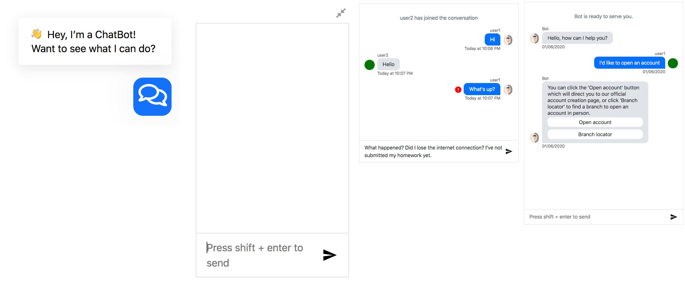

# react-chat-plugin

[](https://circleci.com/gh/leon0707/react-chat-plugin)
[](https://www.npmjs.com/package/react-chat-plugin)
[](https://snyk.io/test/github/leon0707/react-chat-plugin?targetFile=package.json)

This is an easy-to-use react chat plugin.


### [changelog](./changelog.md)

## Features
1. Simple and clean UI
2. Good for chatbot or person to person chat
3. Two different types of messages: `text` or `notification`
4. Error icon
5. Typing indicator
6. Extendable input area
7. Support new line in the input
8. Key board action: `shift + enter` to send the message

## Install
```shell
npm install react-chat-plugin --save
```

## Import
```javascript
import ChatBox from 'react-chat-plugin';

state = {
    messages: [
        {
            'text': 'user2 has joined the conversation',
            'timestamp': 1578366389250,
            'type': 'notification'
        },
        {
            'author': {'username': 'user1', 'id': 1, 'avatarUrl': 'https://image.flaticon.com/icons/svg/2446/2446032.svg'},
            'text': 'Hi',
            'type': 'text',
            'timestamp': 1578366393250,
        },
        {
            'author': {'username': 'user2', 'id': 2, 'avatarUrl': null},
            'text': 'Show two buttons',
            'type': 'text',
            'timestamp': 1578366425250,
            'buttons': [
                {
                    'type': 'URL',
                    'title': 'Yahoo',
                    'payload': 'http://www.yahoo.com'
                },
                {
                    'type': 'URL',
                    'title': 'Example',
                    'payload': 'http://www.example.com'
                }
            ]
        },
        {
            'author': {'username': 'user1', 'id': 1, 'avatarUrl': 'https://image.flaticon.com/icons/svg/2446/2446032.svg'},
            'text': 'What\'s up?',
            'type': 'text',
            'timestamp': 1578366425250,
            'hasError': true
        }
    ]
}

handleOnSendMessage = (message) => {
    this.setState({
        messages: this.state.messages.concat({
            author: {'username': 'user1', 'id': 1, 'avatarUrl': 'https://image.flaticon.com/icons/svg/2446/2446032.svg'},
            text: message,
            timestamp: +new Date(),
            type: 'text'
        })
    });
}

<ChatBox
    messages={this.state.messages}
    userId={1}
    onSendMessage={this.handleOnSendMessage}
    width={'500px'}
    height={'500px'}
/>
```

### Show icon

```javascript
import ChatBox, { ChatFrame } from 'react-chat-plugin';

const handleClickIcon = () => {
    // toggle showChatbox and showIcon
}

<ChatFrame
    chatbox={
        <ChatBox
            onSendMessage={handleOnSendMessage} userId={1} messages={messages}
        />
    }
    clickIcon={handleClickIcon}
    showChatbox={showChatbox}
    showIcon={showIcon}
>
    <div className="Greeting">👋 Hey, I’m a ChatBot! Want to see what I can do?</div>
</ChatFrame>
```

## props
| prop | default | type | required |
| ---- | ---- | ---- | ---- |
| messages | [] | array | N |
| placeholder | "" | string | N |
| userId | null | string/number | Y |
| onSendMessage | null | function | Y |
| timestampFormat | calendar | string | N |
| width | 400px | string | N |
| height | 60vh | string | N |
| disableInput | false | bool | N |
| disabledInputPlaceholder | "" | string | N |
| showTypingIndicator | false | bool | N |
| activeAuthor | object | null | N |
